## AZ-900 Notes

## video

[Microsoft Azure Fundamentals Certification Course (AZ-900) - Pass the exam in 3 hours!](https://www.youtube.com/watch?v=NKEFWyqJ5XA)

[Local AZ-900 Video](../video/AZ-900.mp4)

## Notes

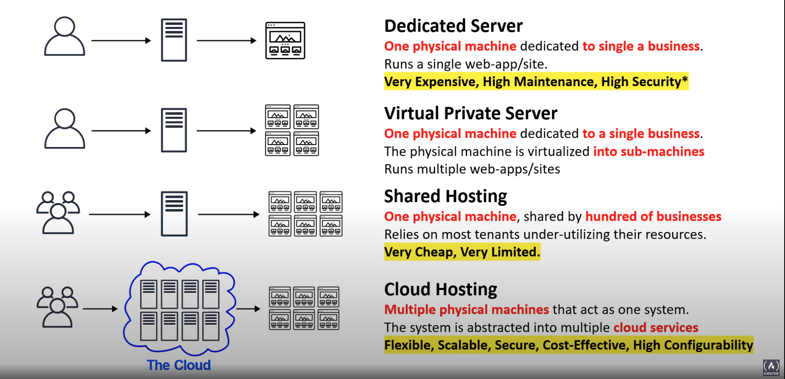

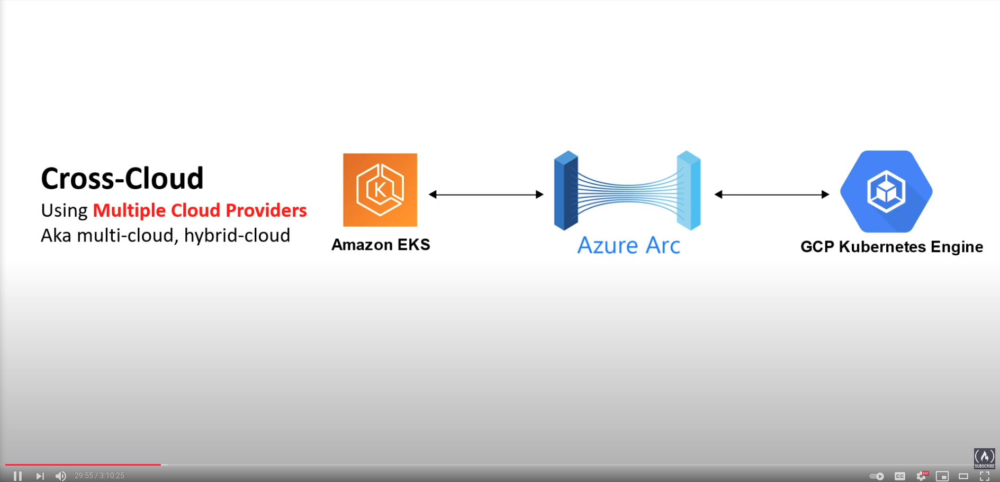

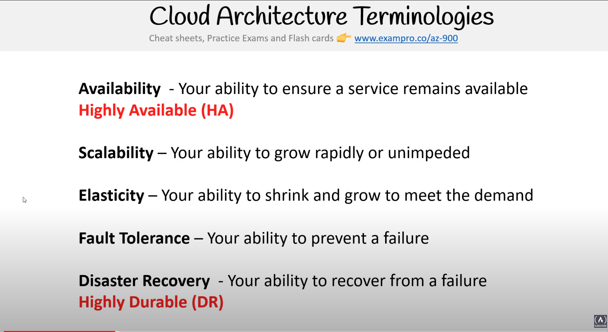

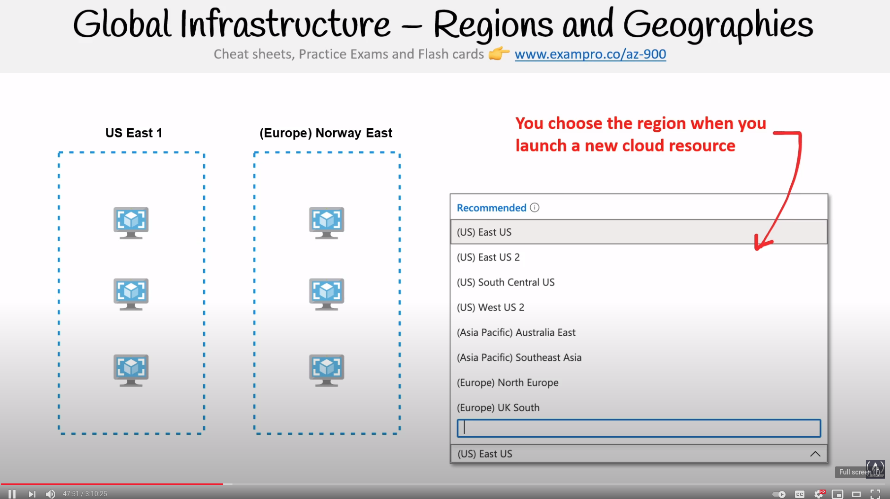

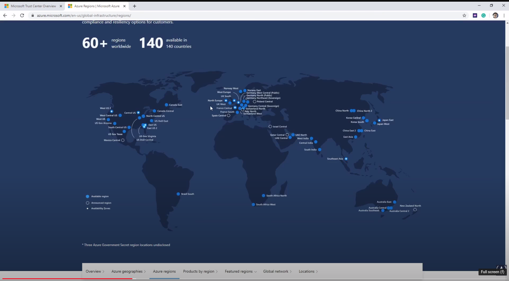

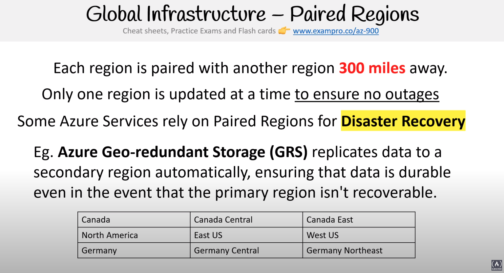

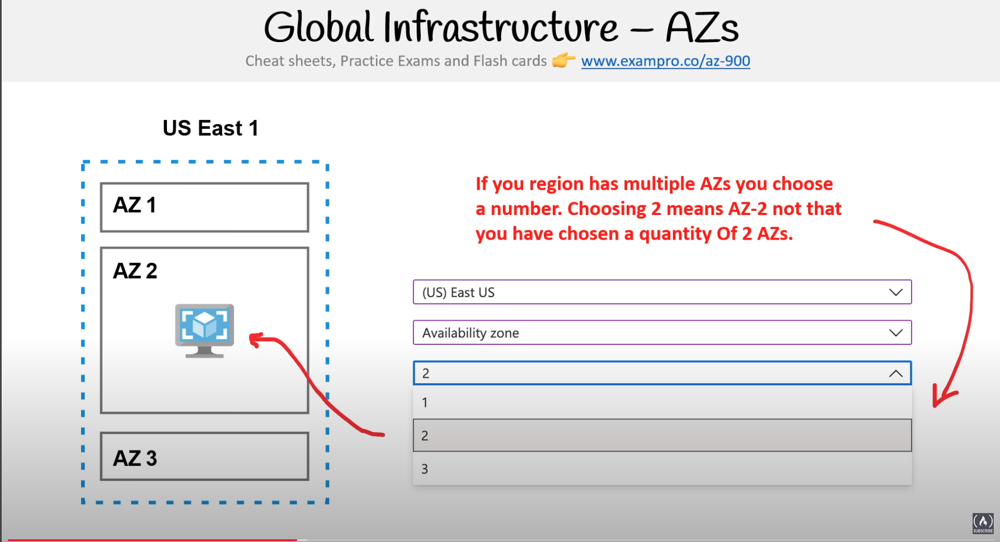

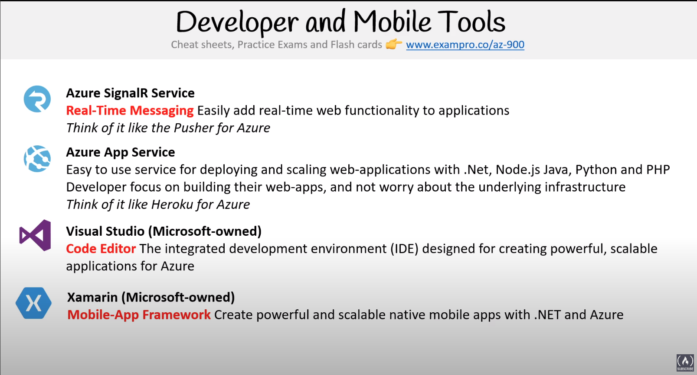

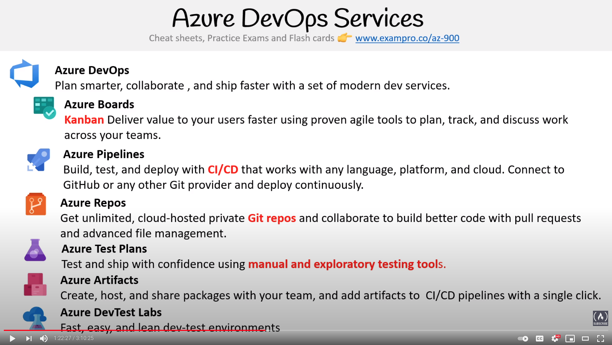

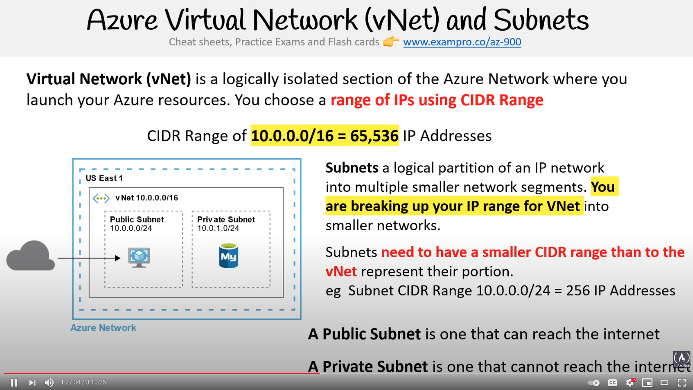

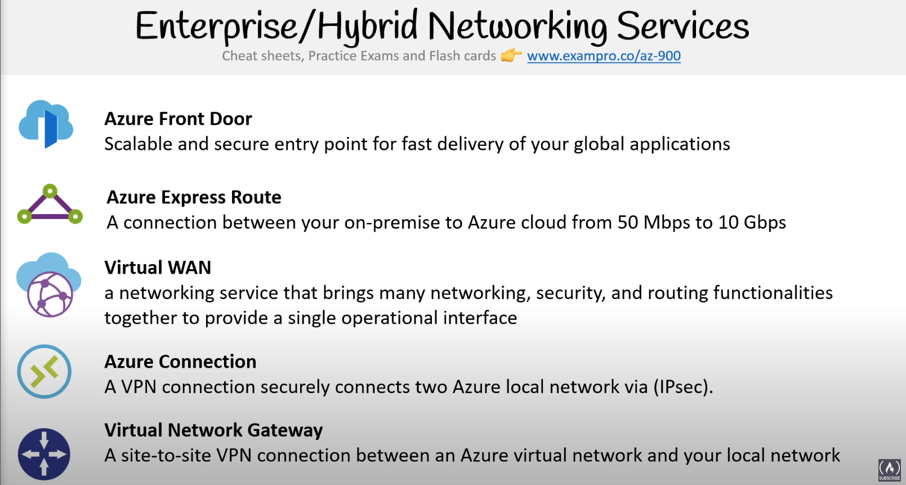

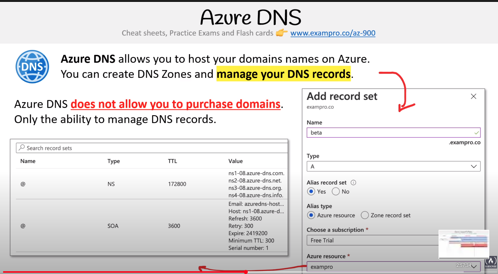

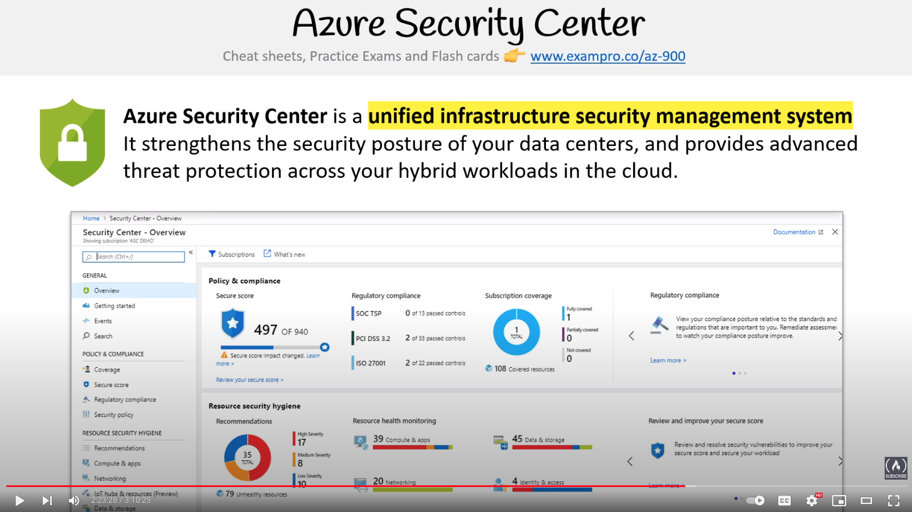

